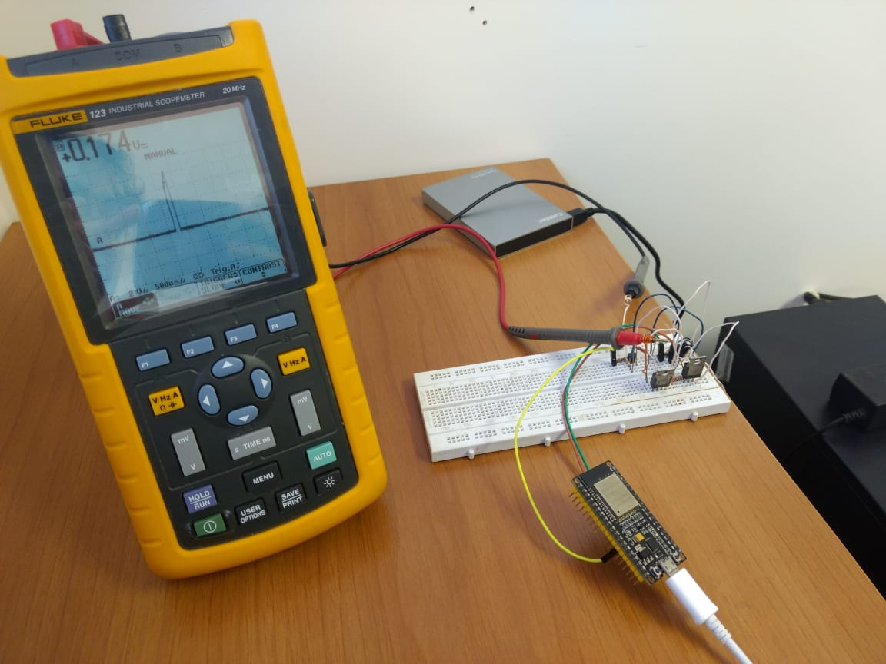
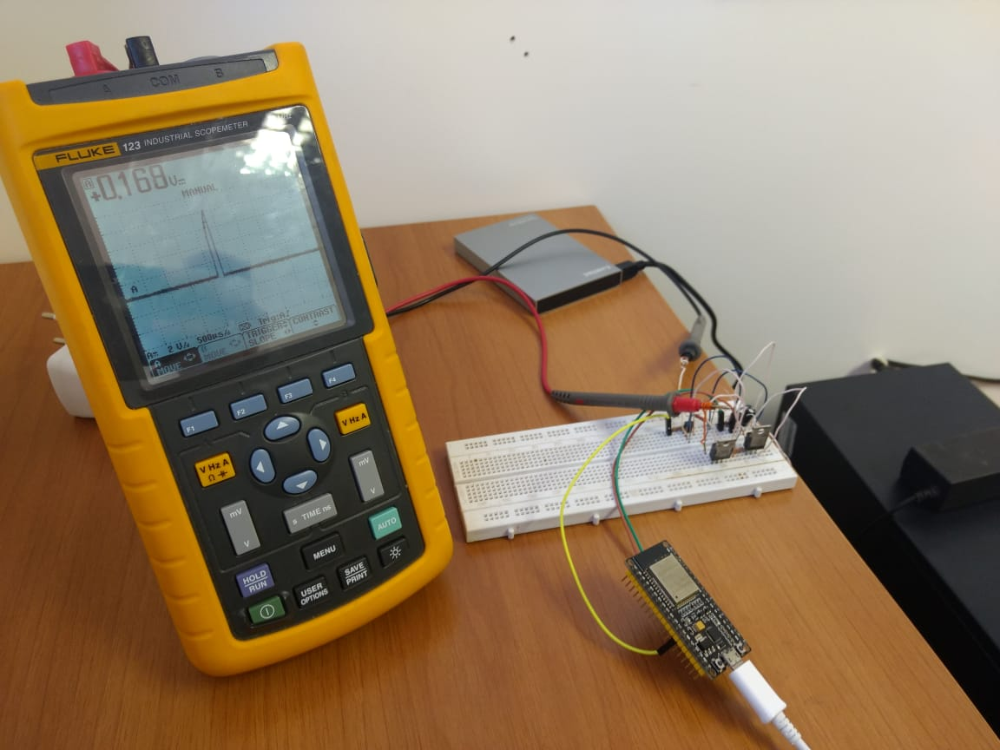

# Product Name
> Short blurb about what your product does.

[![NPM Version][npm-image]][npm-url]
[![Build Status][travis-image]][travis-url]
[![Downloads Stats][npm-downloads]][npm-url]

One to two paragraph statement about your product and what it does.




## Installation


```sh
```

Windows:

```sh

```

## Usage example


## Development setup

## Release History

* 0.2.1
    * xxxxx
* 0.2.0
    * xxxxxx `xxxxxxxxx()`
    * xxxxxxx `xxxxxxxxx()`
* 0.1.1
    * xxxxxxxx `xxxxxxxxxxxx()` (xxxxxxxxxxxxxxxxxxxx)
* 0.1.0
    * xxxxxxxxxxxxxxxxxx
    * xxxxxxxxxxxxxxxx `xxxx()` xxxx `xxxxxx()`
* 0.0.1
    * xxxxxxxxxxxxxxxx

## Meta

xxxxxxxxxxxxxxx – [@YourTwitter](xxxxxxxxxxxxxxxxxxxxxxxxx) – xxxxxxxxxxx@xxxxxxxxxxxx.com

Distributed under the XYZ license. See ``xxxxxxxxxxxx`` for more information.

[https://github.com/yourname/github-link](xxxxxxxxxxxxxxxxxxxxxxxx)

## Contributing

1. Fork it (<https://xxxxxxxxxxxx/yourname/yourproject/fork>)
2. Create your feature branch (`git checkout -b feature/xxxx`)
3. Commit your changes (`git commit -am 'Add some xxxxxxx'`)
4. Push to the branch (`git push origin feature/xxxxxxxxxxxxx`)
5. Create a new Pull Request

<!-- Markdown link & img dfn's -->
[npm-image]: https://img.shields.io/npm/v/datadog-metrics.svg?style=flat-square
[npm-url]: https://npmjs.org/package/datadog-metrics
[npm-downloads]: https://img.shields.io/npm/dm/datadog-metrics.svg?style=flat-square
[travis-image]: https://img.shields.io/travis/dbader/node-datadog-metrics/master.svg?style=flat-square
[travis-url]: https://travis-ci.org/dbader/node-datadog-metrics
[wiki]: https://github.com/yourname/yourproject/wiki
